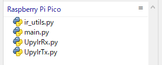
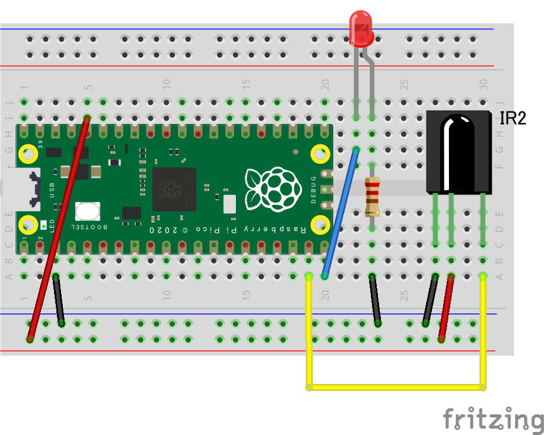

# ir_utils 赤外線リモコンユーティリティ
RaspberryPiPico用、赤外線データの送受信を行うライブラリ

## 概要
Raspberry Pi Pico(RP2040互換)とMicroPythonを利用した赤外線リモコンの送受信を行うためのライブラリです。
以下の機能があります。
 - 受信
   - 受信したデータのノイズ除去
   - データフォーマット（NEC、家製協(AEHA)、SONY）の分析
   - UserCode(CustmerCode)、DataCodeの取得
 - 送信
   - データフォーマット（NEC、家製協(AEHA)、SONY）、UserCode(CustmerCode)、DataCodeを指定して送信
   - データ配列を指定した送信


## 必要なライブラリ
本ライブラリはmeloncookieさんの、[RemotePy](https://github.com/meloncookie/RemotePy/tree/main)で紹介されている、UpyIrRx.py、UpyIrTx.pyを利用しています。\
(meloncookieさんに感謝！！)\
RP2040/FromV1_17の以下の２つファイルをダウンロードしてください。
- UpyIrRx.py
- UpyIrTx.py

## インストール
RaspberryPiPicoにir_utils.pyを配置してください。\


## サンプルプログラムを動かす
以下のような回路を作成します。\
※あくまでもサンプル回路図です。送信距離やセンサー寿命を意識した回路にしたい場合はコンデンサを追加するなどの対策を行ってください。\


起動すると以下のような動作を行います。
1. 起動3秒後にLEDが5秒間光る。
2. 光っている間に赤外線リモコン信号を読み取り保存する。
3. LEDが消える。
4. 5秒後に保存した赤外線リモコン信号を送信する。
5. LEDが消える。
6. 5秒後にLEDが光り2.に戻る。

## ir_readメソッドの仕様
### 引数
- pin: int (デフォルト：14): 赤外線受信センサーのOUTを接続するピン番号 (UpyIrRxのpin)\
- wait_ms: int (デフォルト：3000): 受信状態で待機する時間(ミリ秒) (UpyIrRxのwait_ms)\
- blank_ms: int (デフォルト：200): 空白ミリ秒 (UpyIrRxのblank_ms)\
- stop_size: int (デフォルト：1023): ストップサイズ (UpyIrRxのstop_size)\
- rx_size: int (デフォルト：1023): 最大サイズ (UpyIrRxのidl_level)\
- rx_idle_level: int (デフォルト：1): アイドルレベル (UpyIrRxのidl_level)\
### 戻り値
- result: dict
  - ir_type: str: 赤外線データフォーマット(NEC、家製協(AEHA)、SONY)
  - user_code: str: UserCode
  - data_code: str: DataCode
  - read_data: [int]: 受信した赤外線データ(ノイズ除去)
  - org_read_data: [int]: 受信した赤外線データ
### 使い方
以下のようなコードで、受信した赤外線リモコンデータを受信できます。
```
result = ir_utils.ir_read(pin=14, wait_ms=5000)
print(f'Format: {result["ir_type"]}')
print(f'UserCode: {result["user_code"]}')
print(f'DataCode: {result["data_code"]}')
print(f'IR DATA: {str(result["read_data"])}')
print(f'ORIGINAL DATA: {str(result["org_read_data"])}')
```

## ir_sendメソッドの仕様
### 引数
- ch: int (デフォルト：15): チャンネル (UpyIrTxのch)\
- pin: int (デフォルト：15): 赤外線LEDに接続するピン番号 (UpyIrTxのpin)\
- ir_type: str (デフォルト：None): 赤外線データフォーマット (NEC、家製協(AEHA)、SONY。 ir_dataをセットした時は無視)\
- user_code: str (デフォルト：None): UserCode (ir_dataをセットした時は無視)\
- data_code: str (デフォルト：None): DataCode (ir_dataをセットした時は無視)\
- ir_data: [int] (デフォルト：None): 送信するデータ配列\
- tx_freq: int (デフォルト：38000): 頻度 (UpyIrTxのfreq)\
- tx_duty: int (デフォルト：30): 間隔 (UpyIrTxのduty)\
- tx_idle_level: int (デフォルト：0): アイドルレベル (UpyIrTxのidle_level)\
### 戻り値
- result: str: 送信結果(OK/NG)
- send_ir_data: [int]: 送信したデータ
### 使い方
以下のようなコードで、赤外線データを送信できます。
```
ir_type = 'NEC'
user_code = '40bf'
data_code = '12ed'
result, send_ir_data = ir_utils.ir_send(ir_type=ir_type, user_code=user_code, data_code=data_code)
print(result)
print(send_ir_data)
```
